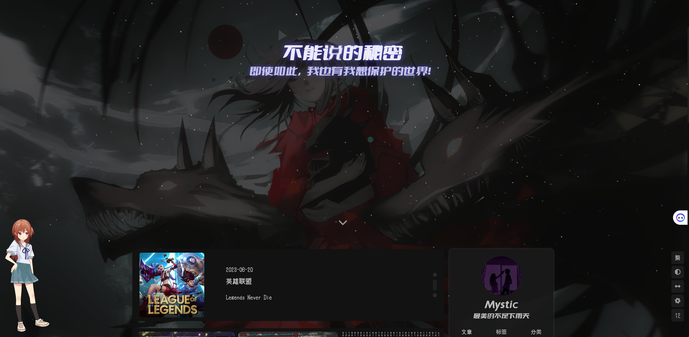
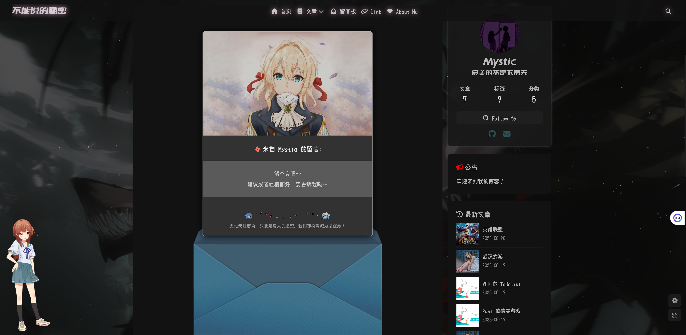
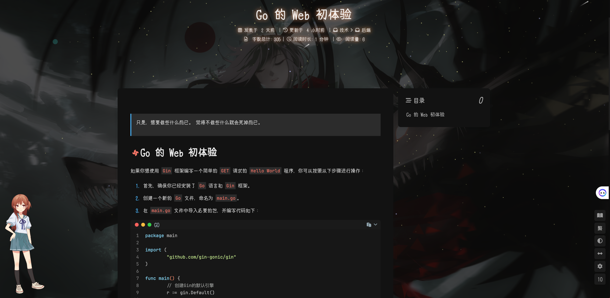
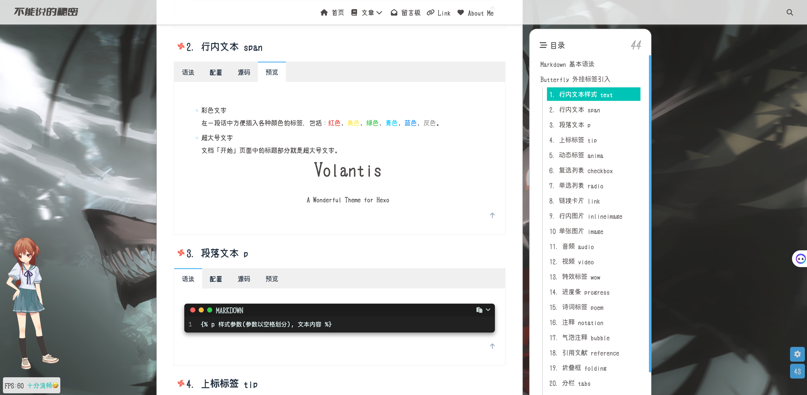

# hexo-theme-pretty

## 介绍

Hexo 配置 butterfly 主题（搭建模板 v2）

## 特点

- 更丰富的项目&主题配置！（唯一`URL`/本地搜索/字数统计等）
- 开箱即用！x3 


## 环境准备

> 基于 hexo-theme-butterfly 4.9.0 master 分支构建

- Node 环境
- Yarn 工具（全局安装）
- Hexo 库（全局安装）


## v2 如何使用

1. 克隆项目

```bash
git clone git@github.com:pokeyaro/hexo-theme-pretty.git
```

2. 进入项目根路径

```bash
cd hexo-theme-pretty/
```

3. 初始化并本地运行

```bash
./start.sh
```

等运行完毕，在浏览器中访问 `http://localhost:4000`，应该能够看到我们的网站了。

Tips：该脚本的本质是运行 Make 的 target，如果本地没有 Make 命令，也可以直接使用原生，详细见 Makefile 内容。

## v2 截图







## 如何编写文章

> 使用标准 `Markdown` 格式，或 `Butterfly` 外挂标签!

*测试环境运行后点击链接：* [Markdown 语法与外挂标签格式](http://localhost:4000/posts/790844471)


